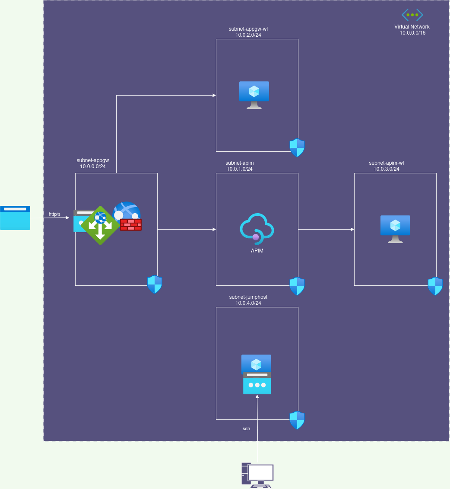

# labs apim
## documentation
 - [docs](./docs/README.md)
- [labs-apim-app code](./code/README.md)

### _steps_
- [x] main infrstructure with terraform
- [x] domain registered
- [x] wild certificate 
- [x] API software 
- [x] WEB software
- [x] Private DNS
- [x] APIM instance
- [x] APP GW instance
  
## reference links

### App GW & APIM
- Azure Learn
  1. [APIM | Configure a JWT validation policy to pre-authorize requests](https://learn.microsoft.com/en-us/azure/api-management/api-management-howto-protect-backend-with-aad#configure-a-jwt-validation-policy-to-pre-authorize-requests)
  2. [APIM az cli](https://learn.microsoft.com/en-us/azure/api-management/get-started-create-service-instance-cli)

-  other
   1. [Protecting APIs with API Management and Application Gateway](https://fabriciosanchez-en.azurewebsites.net/protecting-apis-with-api-management-and-application-gateway/)
   2. [Azure Web Apps, Private Endpoint and APIM to host APIs privately](https://fabriciosanchez.com/azure-web-apps-private-endpoint-and-apim-to-host-apis-privately/)
   3. [Secure APIM with Application Gateway](https://www.youtube.com/watch?v=0chTnPQiRkc)
   4. [Integrate API Management in an Internal VNET with Application Gateway ](https://jaliyaudagedara.blogspot.com/2021/09/integrate-api-management-in-internal.html?m=1)
   5. [Integrating Azure Application Gateway with multiple custom domains with Azure APIM](https://thomasthornton.cloud/2022/01/03/integrating-azure-application-gateway-with-multiple-custom-domains-with-azure-apim/)

### Azure Terraform 
1. [Terraform Azure Modules](https://www.ciraltos.com/modules-and-outputs-with-terraform-and-azure/)
### Let's encrypt
1. [Wildcard SSL certificate by Let's Encrypt](https://codex.so/wildcard-ssl-certificate-by-let-s-encrypt)

## macro design

