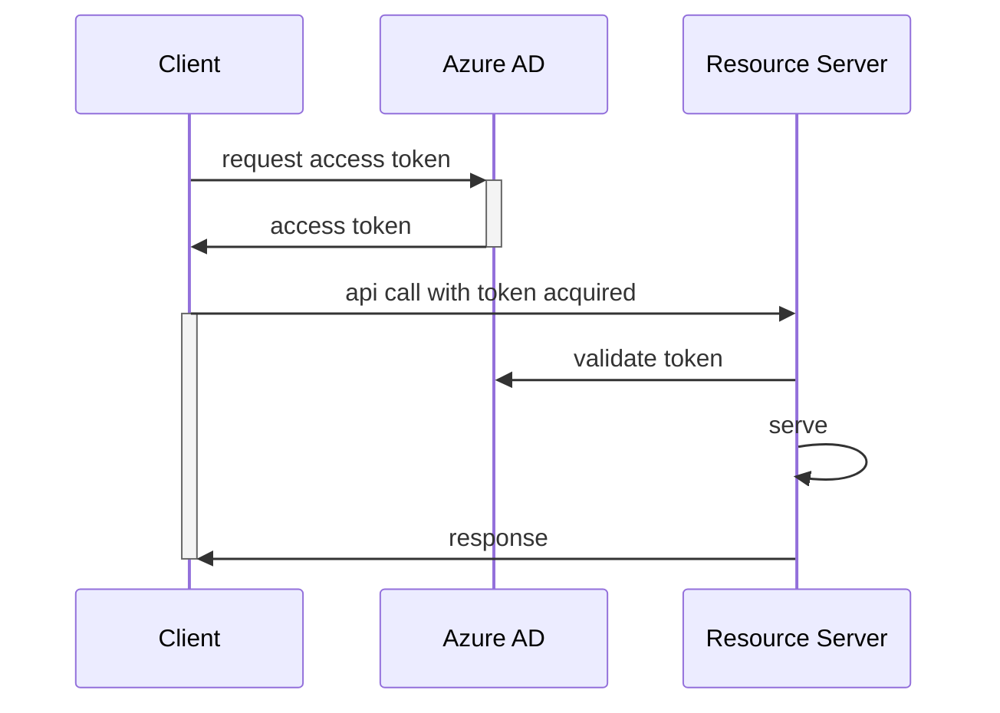

# labs apim

## scenario





```shell
source env.vars.sh

# retrieve 
curl -X POST "https://login.microsoftonline.com/$TENANT_ID/oauth2/v2.0/token" \
  -H "Content-Type: application/x-www-form-urlencoded" \
  -d "client_id=$CLIENT_ID&client_secret=$CLIENT_SECRET&grant_type=client_credentials&scope=$SCOPE" -i

# get access_token
export TOKEN=<access_token>

# call web app
export  BASEURL="https://$DOMAIN"
curl -i -vvv --location "$BASEURL"

# call api
export  BASEURL="https://api.$DOMAIN"
curl -i -vvv --location "$BASEURL/external/api/books" -H "Authorization: Bearer $TOKEN" -H "ocp-apim-subscription-key:$SUB_KEY"
```


## Code

- [software](./labs-apim-app/README.md)
- [terraform](./terraform/README.md)
